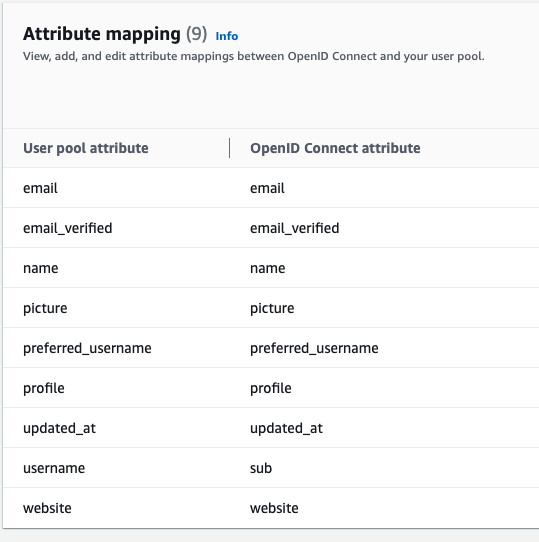

# Discord OpenID Connect Wrapper for Cognito

**This repository is a fork of:** https://github.com/TimothyJones/github-cognito-openid-wrapper

**Please read their README for full details:** https://github.com/TimothyJones/github-cognito-openid-wrapper/blob/master/README.md

*It was inspired by that fork:* https://github.com/qwerqy/discord-cognito-openid-wrapper but since that fork was not maintained and no longer working (some discord oauth endpoints changed over time), I have created another fork from the original repo and applied similar changes in addition to mine.

## Getting Started

This project is intended to be deployed as a series of lambda functions alongside
an API Gateway. This means it's easy to use in conjunction with Cognito, and
should be cheap to host and run.

You can also deploy it as a http server running as a node app.
### 1: Setup

You will need to:

- Create a Cognito User Pool ([instructions](https://docs.aws.amazon.com/cognito/latest/developerguide/cognito-user-pool-as-user-directory.html)).
- Configure App Integration for your User Pool ([instructions](https://docs.aws.amazon.com/cognito/latest/developerguide/cognito-user-pools-configuring-app-integration.html)). Note down the domain name.
- Create a Discord OAuth App ([instructions](https://developer.discord.com/apps/building-oauth-apps/creating-an-oauth-app/), with the following settings:
  - Authorization callback URL: `https://<Your Cognito Domain>/oauth2/idpresponse`
  - Note down the Client ID and secret

(If you use Discord Enterprise, you need the API & Login URL. This is usually `https://<Discord Enterprise Host>/api/v3` and `https://<Discord Enterprise Host>`.)

Next you need to decide if you'd like to deploy with lambda/API Gateway (follow Step 2a), or as a node server (follow Step 2b)

### 2a: Deployment with lambda and API Gateway

- Install the `aws` and `sam` CLIs from AWS:

  - `aws` ([install instructions](https://docs.aws.amazon.com/cli/latest/userguide/installing.html)) and configured
  - `sam` ([install instructions](https://docs.aws.amazon.com/lambda/latest/dg/sam-cli-requirements.html))

- Run `aws configure` and set appropriate access keys etc
- Set environment variables for the OAuth App client/secret, callback url, stack name, etc:

       cp example-config.sh config.sh
       vim config.sh # Or whatever your favourite editor is

- Run `npm install` and `npm run deploy`
- Note down the DNS of the deployed API Gateway (available in the AWS console).

### 2b: Running the node server

- Set environment variables for the OAuth App client/secret, callback url, and
  port to run the server on:

       cp example-config.sh config.sh
       vim config.sh # Or whatever your favourite editor is

- Source the config file:

```
  source config.sh
```

- Run `npm run start` to fire up an auto-refreshing development build of the
  server (production deployment is out of scope for this repository, but you can expose it using something like [ngrok](https://ngrok.com/) for easy development and testing with Cognito).

### 3: Finalise Cognito configuration

- Configure the OIDC integration in AWS console for Cognito (described below, but following [these instructions](https://docs.aws.amazon.com/cognito/latest/developerguide/cognito-user-pools-oidc-idp.html)). The following settings are required:
  - Client ID: The Discord Client ID above
  - Authorize scope: `openid identify email`
  - Issuer: `https://<Your API Gateway DNS name>/${Stage_Name}` or `https://<your webserver>/` (for the node server).
  - If you have deployed the web app: Run discovery (big blue button next to Issuer).
  - If you have deployed the lambda/Gateway: For some reason, Cognito is unable to
    do OpenID Discovery. You will need to configure the endpoints manually. They are:
    - Authorization endpoint: `https://<Your API Gateway DNS name>/${Stage_Name}/authorize`
    - Token endpoint: `https://<Your API Gateway DNS name>/${Stage_Name}/token`
    - Userinfo endpoint: `https://<Your API Gateway DNS name>/${Stage_Name}/userinfo`
    - JWKS uri: `https://<Your API Gateway DNS name>/${Stage_Name}/.well-known/jwks.json`
- Configure the Attribute Mapping in the AWS console:



- Ensure that your new provider is enabled under **Enabled Identity Providers** on the App Client Settings screen under App Integration.

That's it! If you need to redeploy the lambda/API gateway solution, all you need to do is run `npm run deploy` again.
